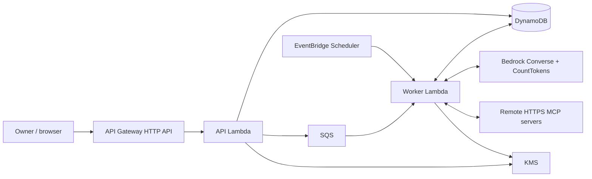

# Architecture

One Rust executable runs as an Axum HTTP API, a Lambda worker, or an ephemeral local server. Agents are data, not separate processes or containers.

## Modules and technology

| Module | Responsibility |
| --- | --- |
| `api` / `app` | Axum routes, owner authentication, configuration and task submission |
| `domain` / `store` | Data records; conditional writes and transactions in DynamoDB or the local memory store |
| `crypto` | Random owner keys, SHA-256 digests, AES-256-GCM envelopes with KMS data keys |
| `connectors` | Official Rust MCP SDK `rmcp`, OAuth via its `oauth2` integration, guarded Reqwest HTTPS transport |
| `oauth_store` | Durable OAuth states, client credentials, rotated tokens and distributed refresh leases |
| `engine` | Generic Bedrock model/tool loop, local JSON Schema argument checks and budget hooks |
| `budget` | Shared monthly reservations and settlement |
| `worker` | Task claims, connector sessions, permitted tool execution, maintenance and dispatch recovery |

Tokio handles asynchronous work; Serde encodes data; AWS clients use the official Rust SDK. Terraform and GitHub Actions build/deploy the isolated stack. See [deployment](../infra/README.md).

## Identity and discovery

Anyone can create an agent. Its single, randomly generated 256-bit owner secret authorizes management and invocation; only its SHA-256 digest is retained. Data keys include the agent ID, and each request verifies ownership of that agent. Connector references cannot cross agents.

Public cards expose descriptions and skill metadata. They use the A2A Agent Card structure and a custom REST `protocolBinding`; they do not advertise an implemented A2A transport. A2A invocation and Aithos-issued caller authentication belong to phase 2. No agent catalogue or separate invocation key is present.

## OAuth across Lambda invocations

1. The API discovers the MCP resource and authorization server, chooses supplied OAuth client credentials or dynamic registration, and prepares PKCE.
2. State, PKCE verifier and redirect context are encrypted in a temporary record valid for 600 seconds. Complete OAuth client configuration is also persisted encrypted.
3. A later Lambda invocation handles the browser callback, validates state/issuer, consumes state once and exchanges the code.
4. Tokens, expiry and registration credentials remain encrypted in durable records **without the temporary state TTL**. Another worker can reconstruct its SDK authorization manager after a cold start.

A refresh lease coordinates concurrent workers. Updated access and refresh tokens are stored together before subsequent use. Refreshes happen when the MCP client needs them and during idle maintenance. The daily schedule processes connections due for maintenance, normally every seven days; transient maintenance errors are deferred, and invalid authorization becomes `reauthorization_required`. Provider lifetimes and revocation still apply. A lost token response during rotation may ultimately require consent again; generic OAuth cannot guarantee recovery from every provider-side failure.

Lambda does not stay alive between tasks. OAuth grants are persisted data, independent of an open MCP/network session. This deployment supports remote HTTPS Streamable HTTP servers, not local stdio processes. A provider with a required proprietary flow or unsupported registration method needs integration work.

## Execution and spending

The worker claims each queued task conditionally, loads its selected Markdown skills, connects their associated MCP servers and exposes only permitted tools to Bedrock. Tool aliases bind the connector and original tool name. The model chooses calls; the backend validates arguments and rechecks connection permissions before execution. Connector credentials are injected by the transport and never included in the model request.

The model is configured with the EU inference profile for Claude Haiku 4.5. Token counting uses the corresponding base model ID because the inference-profile ID does not support CountTokens. Prices are configuration: the initial conservative EU rates are 1,100,000 and 5,500,000 micro-USD per million input/output tokens. Update prices and counting configuration together when changing models.

Before each paid call, CountTokens counts the complete request, including tool schemas and results. An atomic DynamoDB transaction reserves input cost plus maximum output cost against **25,000,000 micro-USD per UTC month**. Known usage settles that reservation in its original month. Ambiguous responses retain it. Automatic retries of paid Converse requests are disabled. This bounds model spending at configured prices; infrastructure and connector charges are separate.

Default execution limits are eight model turns, 2,048 output tokens per turn, 64 tools, 512 KiB serialized model input and 64 KiB per returned tool payload. The worker stops a task after 240 seconds within its 300-second Lambda timeout. These shared technical limits preserve runtime bounds; no per-agent spending allowance is used.

## Delivery and uncertainty

Task creation persists before sending to SQS. A five-minute dispatch schedule retries queued records if enqueueing was interrupted. Conditional claims ensure duplicate deliveries do not start a running task again. SQS failure responses retain individual failed deliveries; expired running leases become `interrupted`, not replayed tasks.

An external MCP write may succeed even when its response is lost. Tool timeouts and ambiguous connector errors stop the loop. The application does not promise exactly-once external effects and does not automatically replay an interrupted task. Idempotency keys deduplicate API task creation; provider-specific verification is still required after an uncertain write.

## Secret and network boundaries

Production secrets use envelope encryption with KMS and authenticated agent/connection context. OAuth stores enforce one-time state, expiry and conditional updates. Public cards and connection listings omit private instructions and credential fields. Logs omit bodies, authorization headers, callback query strings and SDK debug output.

Outbound URLs must use public HTTPS. URL validation and the connection-time DNS resolver reject loopback, private, metadata and special-purpose destinations. Environment proxies are disabled. OAuth metadata redirects are limited to same-origin GETs; token/registration POSTs are not automatically redirected. JSON Schema references cannot fetch remote URLs or local files.

Deleting an agent revokes its local access; disconnecting a connector removes locally stored credentials. Provider-side grants are not automatically revoked, and previously dispatched actions cannot be cancelled retroactively. Open creation and a model budget do not cap unrelated infrastructure traffic costs.

## Verification and remaining integration checks

`cargo test` covers actual HTTP routes, encryption and data isolation, conditional writes, concurrent budget reservations, OAuth restoration and refresh, MCP tool traffic and the Bedrock request adapter. Controlled HTTP fixtures avoid modifying real calendars during tests.

Every chosen real provider still needs a consent-driven smoke test in the deployed environment: authorization, tool discovery, permitted read, worker restart and refresh. Real Notion or Calendly access is not considered proven until that account-specific flow completes. Multi-month durability is an operational property to monitor, not something a short unit test establishes.
